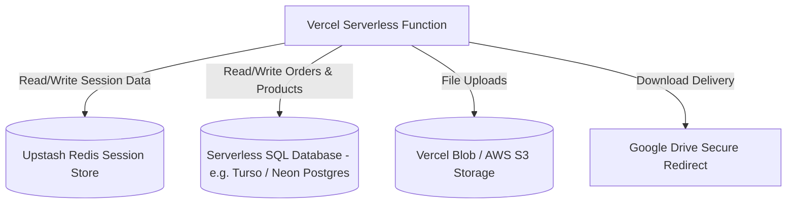

# NEXORA Vercel Deployment Architecture Analysis

This document outlines the incompatibilities of the current NEXORA Express/SQLite application when deployed to the Vercel serverless platform, proposes the safest deployment architecture, and lists the required file-level changes.

---

## ⚠️ Vercel Compatibility Audit

### 1. SQLite Persistence (`nexora.db`)
* **Problem**: Vercel executes Node.js endpoints inside stateless, ephemeral AWS Lambda containers. The filesystem is read-only (except for a temporary `/tmp` directory that is cleared between invocations). Any updates (e.g., creating orders, updating product settings, saving download configs, adding review entries) will fail or be lost as soon as the Lambda container recycles.
* **Why it breaks**: SQLite relies on local write access to a single file (`nexora.db`). On Vercel, this file becomes read-only and static (reflecting only whatever state was bundled during deployment).

### 2. Digital File Uploads (`uploads/`)
* **Problem**: The current system uses `multer.diskStorage` to save uploaded files (digital zips/pdfs for creator products) directly into the `./uploads` folder.
* **Why it breaks**: Vercel will throw read-only filesystem errors (`EROFS: read-only file system, open ...`) when trying to write uploaded files to the local folder at runtime.

### 3. Session Management (`express-session` MemoryStore)
* **Problem**: The session middleware is currently initialized without a storage engine, meaning it defaults to memory (`MemoryStore`).
* **Why it breaks**: Vercel runs multiple serverless functions in parallel. In-memory state is not shared between instances, meaning that an administrator who logs in on one request will be randomly logged out on subsequent requests when handled by a different Lambda container.

### 4. Port Listening (`app.listen()`)
* **Problem**: The server starts by calling `app.listen(PORT, ...)`.
* **Why it breaks**: Vercel endpoints are routed dynamically via serverless function handlers; they do not run continuous processes listening on specific ports. Keeping a blocking `listen` statement will prevent Vercel from cleanly wrapping the application.

---

## 💡 Proposed Safest Deployment Architecture

To host NEXORA on Vercel without losing any functionality or security, we propose the following serverless-friendly architecture:



### Safest Architecture Details:
1. **Database Options**:
   * **Option A (Recommended for SQLite compatibility)**: Use **Turso** (libSQL). It is a serverless SQLite database. We can migrate our schema to Turso and connect via the `@libsql/client` driver. This requires almost zero SQL syntax changes.
   * **Option B**: Use **Supabase** or **Neon Postgres**. This is free, serverless, and robust, but requires adapting SQLite queries to PostgreSQL syntax (e.g., replacing SQLite specific syntax).
2. **Session Storage**:
   * Use **stateless JWT tokens** or **Redis-backed sessions** (via `connect-redis` + **Upstash Redis** free tier) to share session state across serverless instances.
3. **File Upload Storage**:
   * Replace local `multer` storage with **Vercel Blob** storage or **AWS S3** (`multer-s3`). This uploads administrative files directly to a cloud bucket and saves the URL inside the database.

---

## 🛠️ Required File Changes (Proposed Checklist)

### 1. [`package.json`](file:///c:/Users/yuvra/OneDrive/Desktop/FUNDING%20WEB/package.json)
* Add `@libsql/client` (if using Turso) or Postgres libraries.
* Add `connect-redis` and `ioredis` (or `@upstash/redis`) for session storage.
* Add `@vercel/blob` (or `multer-s3`) for file uploads.

### 2. [NEW] [`vercel.json`](file:///c:/Users/yuvra/OneDrive/Desktop/FUNDING%20WEB/vercel.json)
Create a config file in the root folder to route all request paths to `server.js`:
```json
{
  "version": 2,
  "builds": [
    {
      "src": "server.js",
      "use": "@vercel/node"
    }
  ],
  "routes": [
    {
      "src": "/(css|js|images|admin)/(.*)",
      "dest": "/$1/$2"
    },
    {
      "src": "/(.*)",
      "dest": "server.js"
    }
  ]
}
```

### 3. [`database.js`](file:///c:/Users/yuvra/OneDrive/Desktop/FUNDING%20WEB/database.js)
* Replace `sqlite3` driver with the Turso/libSQL client driver.
* Connect using environment credentials:
  ```javascript
  const { createClient } = require('@libsql/client');
  const db = createClient({
    url: process.env.TURSO_DATABASE_URL,
    authToken: process.env.TURSO_AUTH_TOKEN
  });
  ```
* Rewrite schema synchronization queries (`CREATE TABLE`, `ALTER TABLE`) to use the new connection client.

### 4. [`server.js`](file:///c:/Users/yuvra/OneDrive/Desktop/FUNDING%20WEB/server.js)
* **Sessions**: Configure the session store to use Redis instead of standard memory:
  ```javascript
  const RedisStore = require("connect-redis").default;
  const Redis = require("ioredis");
  const redisClient = new Redis(process.env.REDIS_URL);
  app.use(session({
    store: new RedisStore({ client: redisClient }),
    secret: process.env.SESSION_SECRET,
    ...
  }));
  ```
* **Multer**: Replace `multer.diskStorage` configuration with Vercel Blob API or AWS S3 upload.
* **app.listen()**: Wrap the listening function so it only runs locally:
  ```javascript
  if (process.env.NODE_ENV !== 'production' && require.main === module) {
    app.listen(PORT, () => {
      console.log(`Server is running at http://localhost:${PORT}`);
    });
  }
  module.exports = app; // Required for Vercel node wrapper
  ```

### 5. [NEW] Database Migration Script (`migrate.js`)
* Create a script to copy schemas and existing rows from the local SQLite `nexora.db` up to the Turso/Postgres cloud instance before launching.
