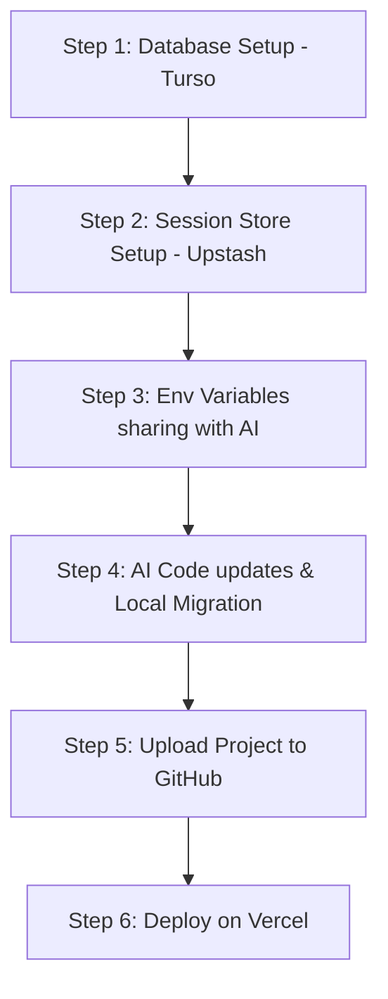

# NEXORA — Vercel Deploy Karne Ki Step-by-Step Guide 🚀

इस गाइड में बहुत ही आसान शब्दों में बताया गया है कि आपको वेबसाइट लाइव करने के लिए क्या-क्या करना होगा और किस क्रम (order) में करना होगा। 

> [!NOTE]
> **अभी कोडिंग या फ़ाइल में बदलाव करने की बिल्कुल ज़रूरत नहीं है।** सबसे पहले आपको कुछ फ्री अकाउंट्स सेटअप करने होंगे ताकि हमें डेटाबेस और सेशन्स के क्रेडेंशियल्स मिल सकें।

---

## 📋 Task Order (आपको किस ऑर्डर में काम करना है)

---

## 🛠️ Step-by-Step Details

### 1. Step 1: Database Setup (Turso) 🗄️
NEXORA का पूरा डेटा (products, settings, orders) क्लाउड में सुरक्षित रखने के लिए हम **Turso** का इस्तेमाल करेंगे (यह SQLite का ही क्लाउड वर्शन है, इसलिए कोई भी पुराना डेटा डिलीट नहीं होगा)।
1. [Turso Signup Page](https://turso.tech) पर जाएं और अपना फ्री अकाउंट बनाएं।
2. लॉगिन करने के बाद **Create Database** पर क्लिक करें और डेटाबेस का नाम `nexora-db` रखें।
3. डेटाबेस बनने के बाद, आपको दो चीज़ें कॉपी करनी हैं:
   * **Database URL** (यह `libsql://...` जैसा दिखेगा)
   * **Auth Token** (डेटाबेस का पासवर्ड)
4. इन दोनों चीज़ों को एक जगह सेव कर लें।

---

### 2. Step 2: Session Setup (Upstash Redis) 🔑
वेबसाइट पर एडमिन लॉगिन को चालू रखने के लिए हमें एक सेशन्स डेटाबेस की ज़रूरत पड़ेगी ताकि पेज रीफ़्रेश या सर्वर रीस्टार्ट होने पर लॉगिन सेशन एक्सपायर न हो।
1. [Upstash Signin](https://upstash.com) पर जाएं और फ्री अकाउंट बनाएं।
2. **Redis Database** सेक्शन में जाकर **Create Database** पर क्लिक करें।
3. डेटाबेस का नाम `nexora-sessions` रखें।
4. डेटाबेस बनने के बाद, नीचे स्क्रॉल करें और **Connection String** या **UPSTASH_REDIS_REST_URL** कॉपी कर लें।

---

### 3. Step 3: Env Variables sharing with AI 🤖
जब आपके पास ये क्रेडेंशियल्स आ जाएं, तो आप हमें (AI असिस्टेंट) चैट में सेंड कर दें:
* **Turso Database URL**
* **Turso Auth Token**
* **Upstash Redis Connection URL**

---

### 4. Step 4: AI Code updates & Local Migration (AI करेगा) ⚙️
क्रेडेंशियल्स मिलने के बाद:
1. **हम कोड बदलेंगे**: हम बिना कुछ बिगाड़े कोडिंग फ़ाइलों को Vercel और क्लाउड डेटाबेस के लिए तैयार करेंगे।
2. **डेटा माइग्रेशन करेंगे**: हम आपके पुराने कंप्यूटर के लोकल डेटाबेस (`nexora.db`) के सारे प्रोडक्ट्स, ऑर्डर्स और सेटिंग्स को ऑटोमैटिकली आपके नए क्लाउड डेटाबेस (Turso) में कॉपी (migrate) कर देंगे।

---

### 5. Step 5: Upload Project to GitHub 💻
वेबसाइट को Vercel पर लोड करने के लिए उसे GitHub पर डालना होगा।
1. [GitHub](https://github.com) पर अकाउंट बनाएं।
2. अपने कंप्यूटर पर इस प्रोजेक्ट के फोल्डर को एक प्राइवेट या पब्लिक GitHub रिपोजिटरी में अपलोड (Push) कर दें। (अगर आपको यह नहीं आता, तो हम आपको इसकी कमांड्स भी लिखकर देंगे)।

---

### 6. Step 6: Deploy on Vercel 🌐
1. [Vercel Deployment](https://vercel.com) पर जाएं और अपने GitHub अकाउंट के साथ लॉगिन करें।
2. **Add New** -> **Project** पर क्लिक करें और अपने प्रोजेक्ट की GitHub रिपोजिटरी को सिलेक्ट (Import) करें।
3. **Environment Variables** सेक्शन में ये वेरिएबल्स ऐड करें:
   * `TURSO_DATABASE_URL` (आपका Turso URL)
   * `TURSO_AUTH_TOKEN` (आपका Turso Auth Token)
   * `REDIS_URL` (आपका Upstash Redis URL)
   * `SESSION_SECRET` (कोई भी सीक्रेट पासवर्ड, जैसे `nexora_universe_secret_key`)
4. **Deploy** पर क्लिक करें। 
5. बस! 2 मिनट में आपकी वेबसाइट लाइव हो जाएगी और Vercel आपको एक लाइव लिंक दे देगा।

---

## 🚀 आगे क्या करना है?
आप **Step 1 (Turso)** and **Step 2 (Upstash)** का सेटअप पूरा करके चैट में क्रेडेंशियल्स सेंड करें, ताकि हम कोडिंग फ़ाइलों को अपडेट करना शुरू कर सकें।
